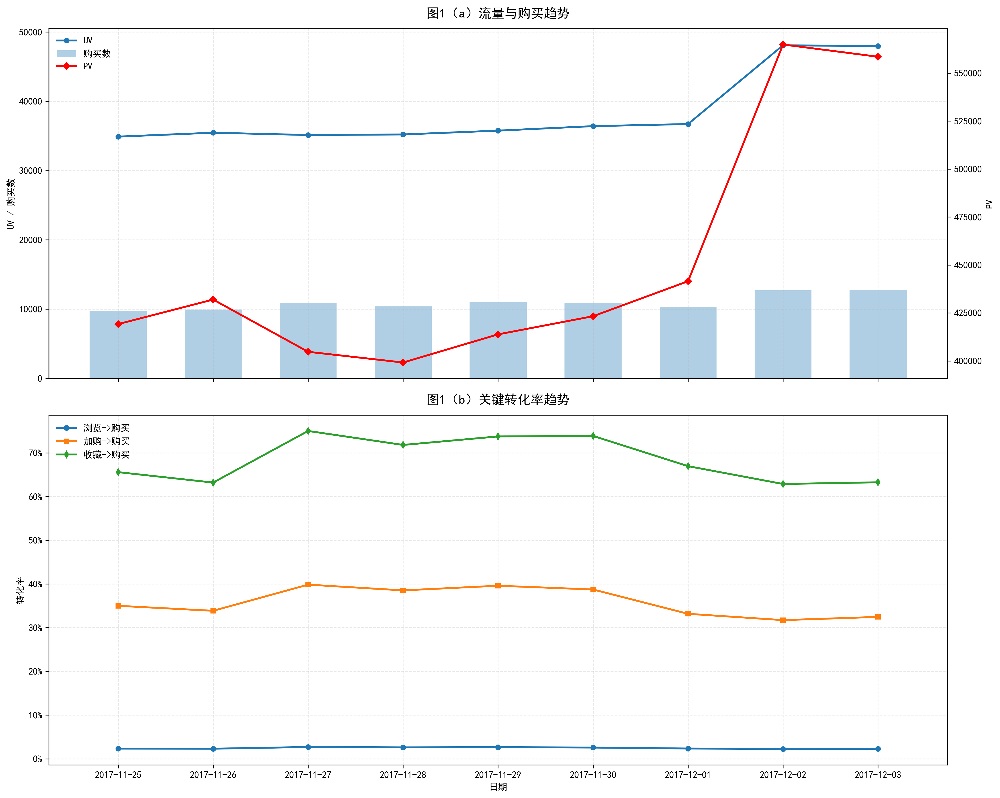
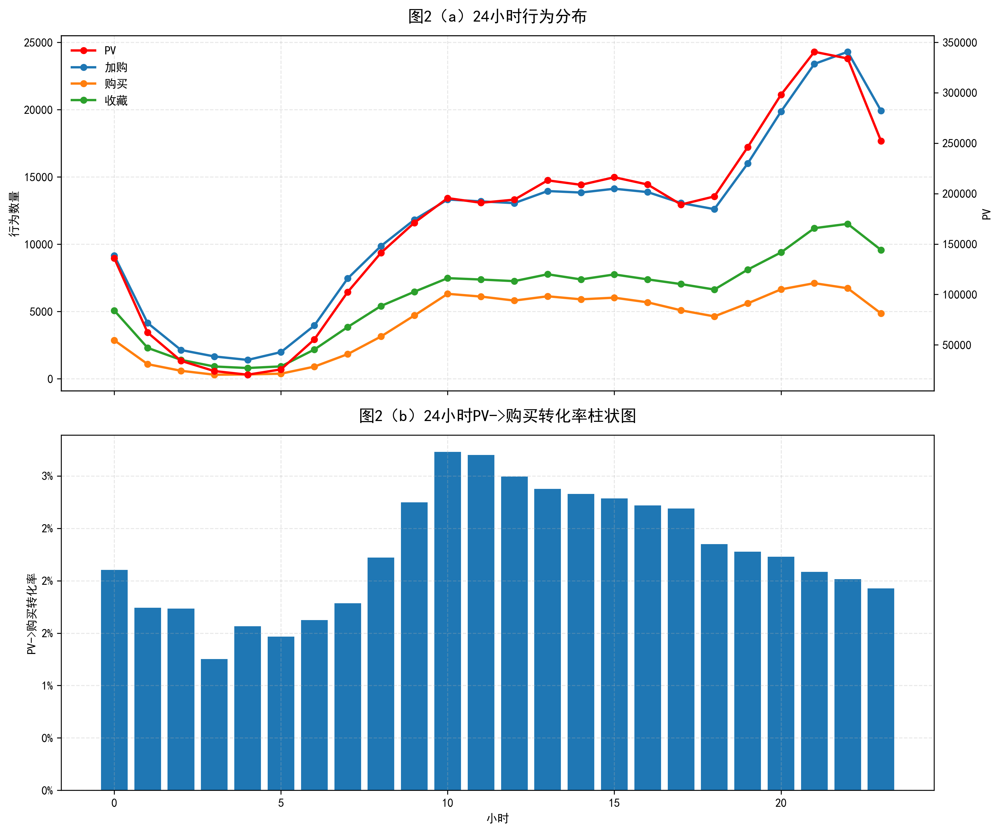
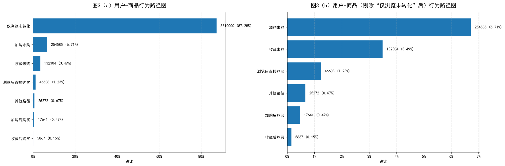
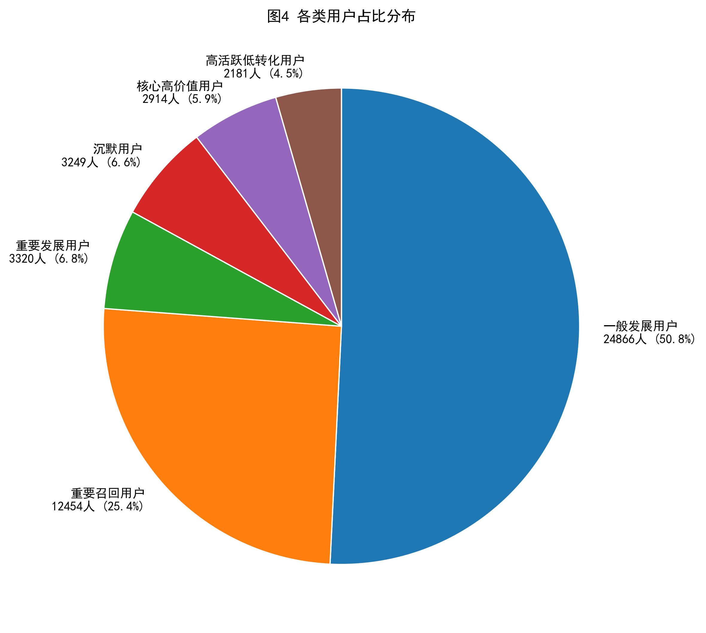

[README.md](https://github.com/user-attachments/files/26443995/README.md)
# 基于 MySQL + Python 的淘宝用户行为分析项目

## 一、项目简介
本项目基于阿里云天池淘宝用户行为数据，抽取前 500 万条记录作为分析样本，使用 MySQL 完成数据清洗与分析表构建，使用 Python 完成指标计算与可视化展示。项目从流量趋势、分时行为、用户-商品行为路径和用户价值分层四个维度展开分析，并结合结果提出运营优化建议。

## 二、项目亮点
- 基于淘宝用户行为数据完成 500 万条样本的抽样、清洗与分析
- 使用 MySQL 构建分析主题表，使用 Python 完成指标计算与可视化
- 从流量趋势、行为路径、转化表现、用户分层四个维度展开分析
- 输出可视化图表与业务结论，形成完整的数据分析项目闭环

## 三、数据来源
数据来源于阿里云天池淘宝用户购物行为公开数据集，包含约1亿条用户行为记录，时间范围为2017年11月25日至2017年12月3日，数据字段主要包括用户 ID、商品 ID、商品类目 ID、行为类型及时间戳。本项目使用 Python 从原始数据中提取前 500 万条用户行为记录作为样本数据集，并在此基础上完成后续的工作。  
数据集链接：[阿里云天池淘宝用户购物行为数据集](https://tianchi.aliyun.com/dataset/649)

## 四、技术栈
- Python：pandas、numpy、matplotlib
- MySQL：数据导入、清洗、分析表构建

## 五、项目结构
```
taobao_user_behavior_analysis/
├── sql_code/ 
│ ├── 01_create_and_load_data.sql # 数据库创建和表结构定义脚本
│ ├── 02_clean_data.sql           # 数据预处理脚本
│ └── 03_build_ads_tables.sql     # 数据分析表创建脚本
├── python_code/ 
│ ├── 01_sample_data.py           # 数据抽样脚本   
│ └── 02_data_analysis.py         # 数据分析与可视化脚本
├── output/ 
│ ├── figures/                    # 可视化图表输出  
│ └── tables/                     # 部分结果表输出
├── README.md
└── README_files/
```
## 六、数据准备

### 1.样本数据抽取
执行 python_code/01_sample_data.py 脚本对源数据集进行样本集的抽取。
### 2.原始表创建与样本数据导入
执行 sql_code/01_create_and_load_data.sql 脚本创建原始表（user_behavior_raw）并导入样本数据集。
### 3.数据清洗
执行 sql_code/02_clean_data.sql 脚本对数据进行空值检查、异常行为过滤以及时间字段标准化处理。
### 4.数据分析表创建
执行 sql_code/03_build_ads_tables.sql 脚本创建每日流量趋势表、小时流量与行为分布表、用户-商品行为分布表、用户画像表作为分析主题表用于后续python的分析以及可视化。

## 七、数据分析及可视化结果

### 1.脚本执行
执行 python_code/02_data_analysis.py 脚本对分析表进行每日流量趋势分析、各小时流量与行为分析、用户-商品行为路径分析与基于活跃天数、最近活跃、购买频率三维度的用户价值分层。最终输出结果表与可视化结果。


### 2. 可视化结果解读

#### (1) 日级流量与转化趋势分析



- 从图1(a)可以看出，在2017-11-25至2017-12-01期间，平台整体运行较为平稳。UV基本维持在3.5万至3.8万之间，PV维持在51万至53万之间，购买数大致稳定在1万至1.1万之间，说明平台在常规经营状态下流量规模和成交规模波动较小，整体运营状态较为稳定。  
- 但在2017-12-02，平台UV显著上升，PV也同步跃升，购买数虽然有所增长，但增长幅度明显低于UV、PV的提升幅度。该现象可能与周末流量提升及“双十二”促销预热的叠加效应有关。从结果看，平台成功增加了许多访客和浏览，但新增流量并未完全等比例转化为购买行为。
- 图1(b)进一步刻画了关键转化率的变化趋势，可以观察到收藏到购买以及加购到购买的转化率显著高于浏览到购买的转化率，说明收藏与加购行为有明显的购买意向。然而，伴随2017-12-02的流量放大，收藏到购买以及加购到购买的转化率不仅没有提升，反而出现一定程度的下降，这说明高流量阶段并没有实现高意向用户的增加。

#### (2) 24小时行为与转化率分析



- 从图2(a)看，用户活跃度呈现明显的分时段特征：凌晨2:00—5:00为全天低谷期，6:00之后各项行为逐步恢复，10:00—18:00进入平稳阶段，20:00—22:00达到全天高峰期。这说明平台用户在一天中的行为具有明显的规律，晚间时段是主要高峰期。
- 进一步结合图2(b)，在行为数量最高峰的时段转化效率并不是最高的，反而在10:00-12:00左右转化效率到达峰值。说明用户在晚间更偏向于“逛”，而在中午才是转化效率的高峰期。

#### (3) 用户-商品行为路径分析



- 从图3(a)可以看出，“仅浏览未转化”路径占比高达 87.28%，远高于其他所有行为路径。这表明，绝大多数用户—商品交互都停留在浏览层面，没有进一步发展为加购、收藏或购买行为。
- 为了更清晰地观察高意向用户的行为结构，图3(b)进一步剔除了“仅浏览未转化”路径。可以看出，在非纯浏览用户中，“加购未购”与“收藏未购”的用户占比位于前列，而最终完成购买的用户占比依旧很低，说明平台不缺少高意向用户，而是这部分用户没有转化为订单。
- 综合来看，图3揭示了目前平台的两个关键问题：一是大部分用户浏览后并未转化为高意向用户；二是即使已经属于高意向用户，他们在最后一步转化为订单的占比过低。

#### （4） 用户分层结构分析

为刻画用户近期活跃性、购买频次与持续参与程度，本模块基于 Recency、Frequency 和 Active Days 三个维度进行五分制评分。其中，R 采用反向评分，最近活跃的用户得分更高；F 和活跃天数采用正向评分，购买频次越高、活跃天数越多的用户得分越高。在此基础上，将用户划分为核心高价值用户、重要发展用户、高活跃低转化用户、重要召回用户、一般发展用户和沉默用户。



- 从结果看，一般发展用户占比最高，达到 50.8%，说明平台当前的用户基础主要由中间层用户构成。对于平台而言，这部分人群是后续提升各个转化率，用户活跃度，促进购买的重要基础。
- 重要召回用户占比达到 25.4%，比例较高，表明平台中存在相当一部分用户曾经有高购买频率或高活跃度，但当前需要重新召回。
- 而核心高价值用户占比最低为 5.9%，整体规模相对有限。这说明平台真正稳定，能够持续提供价值的用户层较弱，当前的高价值用户沉淀能力还有较大提升空间。与此同时，高活跃低转化用户占比为 4.5%，这类用户具有较高访问和行为活跃度，但转化效果不理想，是典型的优化对象。

### 3. 总结

- 第一，平台当前并不缺少流量和行为活跃度，但流量增长尚未稳定转化为购买增长，增长质量仍有提升空间。
- 第二，平台的主要流失发生在浏览后的行为转入阶段，也发生在高意向用户的最终购买阶段，转化路径仍不顺畅。
- 第三，平台用户结构中存在较大的可发展和可召回人群，为后续精细化运营提供了空间，但核心高价值用户占比仍然不足。

基于以上分析，可以初步提出以下优化方向：一是围绕高流量时段提升页面承接和活动转化效率，避免仅停留在流量放大层面；二是针对加购未购、收藏未购和高活跃低转化用户设计个性化召回和促单策略；三是结合一般发展用户、重要发展用户和重要召回用户的分层特征，构建更精细的用户运营路径，推动用户从中间层向高价值层迁移。


## 八、后续优化方向
- 引入 RFM / 聚类模型进一步完善用户分层
- 构建漏斗模型并量化关键环节流失率
- 尝试用户购买预测或流失预警模型
